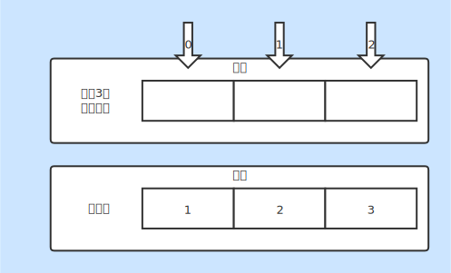

# 数组

### 初始化方式
* 直接通过`new`申请数组空间
* 可以使用`{}`进行初始值创建
* 一维数组初始化：
    + `int[] i = new int[5];` 申请5个含默认值的内存空间，索引从0开始
    + `int[] i = new int[]{1};` 申请1个含1的内存空间，即`i[0] = 1`
    + `int i[] = {1};` 等同于`i[0] = 1`
* 二维数组初始化：
    + `double[][] d = new double[2][];` 初始数组为二行
    + `d[1] = new double[1];` 初始化第二行第二列
    + `double[][] d = new double[][]{};` 初始化空数组
    + `double d[][] = {{}, {}};` 初始化空数组
    + `double[] d[] = {};` 初始化空数组

### 数组属性
* length：返回数组长度

### 数组的优劣
* 随机访问快（通过索引访问）
* 增删比较慢（通过移动元素实现）

### 数组实现
* [Array.java](./Array.java)

### 基本说明
* 数组下标（索引）从0开始
* 数组初始化完毕后长度不能改变
* 数组只能存放同一数据类型的值
* 数组申请一片连续的内存空间
* 数组下表越界异常：`ArrayIndexOutOfBoundsException`

### 图片说明
