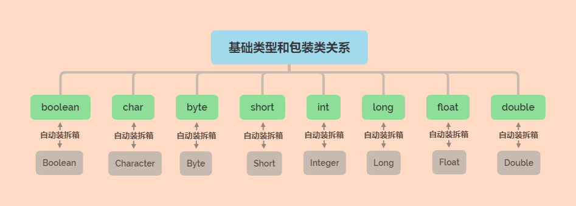

# Java九大基本类型

### 布尔型
* boolean
* 默认值：false
* 范围：true，false
* 占用字节：1byte 或 4byte（与JVM有关）
* 包装类：Boolean

### 字符型
* char
* 默认值：\u0000
* 范围：-2^(16-1)~2^(16-1)
* 占用字节：2byte
* 包装类：Character

### 字节型
* byte
* 默认值：0
* 范围：-2^(8-1)~2^(8-1)
* 占用字节：1byte
* 包装类：Byte

### 短整型
* short
* 默认值：0
* 范围：-2^(16-1)~2^(16-1)
* 占用字节：2byte
* 包装类：Short

### <整数型>
* int
* 默认值：0
* 范围：-2^(32-1)~2^(32-1)
* 占用字节：4byte
* 包装类：Integer

### 长整型
* long
* 默认值：0L
* 范围：-2^(64-1)~2^(64-1)
* 占用字节：8byte
* 包装类：Long

### 单精度浮点型
* float
* 默认值：0.0F
* 占用字节：4byte
* 包装类：Float

### <双精度浮点型>
* double
* 默认值：0.0
* 占用字节：8byte
* 包装类：Double

### 引用型
* 默认值：null

### 相关文件
* [Base.java](./Base.java)
* [基础类型和包装类关系.xmind](./思维导图/基础类型和包装类关系.xmind)

### 基本说明
* 包装类自动拆箱成基本类型
* 基本类型自动装箱成包装类
* 包装类能同基本类型进行算术运算

### 相对关系
