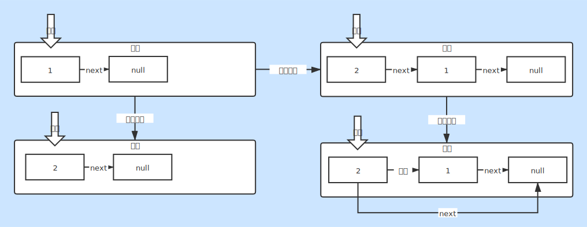

# 链表

### 链表类别
* 单向链表
    + 节点中只包含属性值和后继节点
    + [单链表](./LinkedList.java)
* 双向链表
    + 节点中包含前驱节点，属性值和后继节点

### 链表结构
* 单项链表
    + val：当前属性值
    + next：下一个节点
* 双向链表
    + pre：上一个节点
    + val：当前属性值
    + next：下一个节点

### 链表的优劣
* 方便元素快速删除（通过控制节点指针）
* 占用存储空间大（每一个节点包含多个属性）

### 链表生成过程（尾插法）
1. 有一个根节点root
2. 使用tmp=root
3. 移动到最后一个非空节点tmp=tmp.next
4. 将tmp的下一个节点指向新节点tmp.next=new Node(val);

### 链表逆序过程
1. 设置一个newNode=null
2. 使用tmp=root.next
3. 设置root.next=newNode
4. 设置newNode指向root
5. 设置root=tmp
6. 重复2~5步，直到root=null
7. 将newNode赋值给root，逆序完成

### 基本说明
* 链表是一个集合体
* 链表在内存中可连续也可不连续
* 链表会保存与其相关的节点的信息

### 图片说明
