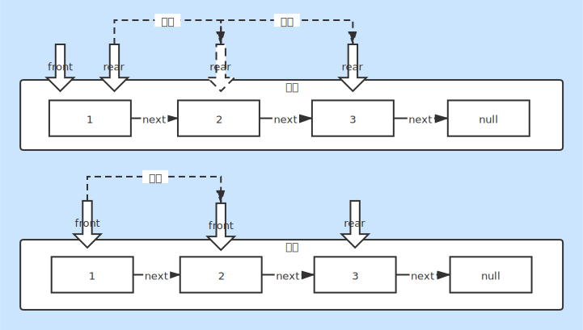

# 队列

### 队列特性
* 先进先出（FIFO）
* 始终从队头出队
* 始终从队尾入队
* 队空：front为null

### 队列结构
* 队头指针：front
* 队尾指针：rear
* 队列容量：size

### 队列用途
* 层次序打印二叉树

### 队列生成过程
* 元素入队：队尾顶指针向后移动
* 元素出队：队头顶指针向后移动

### 队列实现
* [Queue.java](./Queue.java)

### 图片说明
