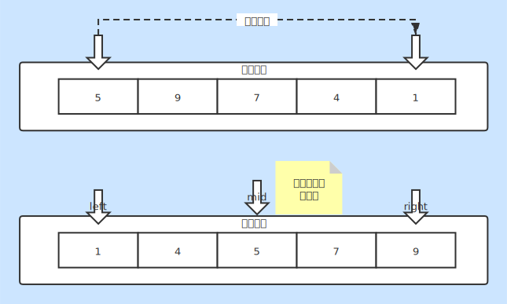

# 查找

### 查找类别
* 顺序查找
* 二分查找

### 查找说明
* 顺序查找
    + 从一组数据中依次查找目标
    + 时间复杂度O(n)
* 二分查找
    + 从一组 **有序** 数据中查找目标
    + 时间复杂度O(log2n)

### 二分查找说明
* 数据定义
    + left：左边索引（指针）
    + **mid**：中间索引（指针）
    + right：右边索引（指针）
    + **target**：目标数据
* 查找步骤（有序数据递增情况）
    + 每次让 **target** 与 **mid** 位置数据比较，如果命中则找到
    + **target** 比 **mid** 位置数据大，则：`left = mid + 1`
    + **target** 比 **mid** 位置数据小，则：`right = mid - 1`
* 时间复杂度说明
    + 每次都和中间数据比较因此n/2k
    + 当n接近无穷大时，k = log2n
    + n：元素个数
    + k：查找次数

### 查找实现
* [Search.java](./Search.java)

### 图片说明
