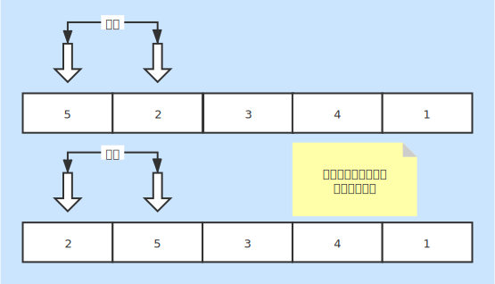

# 冒泡排序
* 一种基本的内排序

### 基本说明
* 一趟遍历后 **最大（小）**出现在了 **最左（右）**位置
* 从索引0开始，连续的两个元素比较大小，满足条件就交换

### 时间复杂度
* 最好情况：O(n)
    + 数据有序情况下只需要一次遍历
* 最坏情况：O(n2)
    + 数据凌乱，每次都需要交换位置
* 平均情况：O(n2)

### 空间复杂度
* 复杂度：O(1)
* 内部完成排序，无需其他空间

### 稳定性
* 稳定排序
* 两两相互比较，满足条件交换，排序后相同数据相对位置没有改变

### 图片说明
