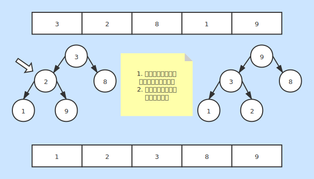

# 堆排序
* 一种基本的内排序

### 基本说明
* 将数据生成一个大（小）顶堆
* 将堆顶元素与每次堆尾元素进行交换
* 重新调整生成一个大（小）顶堆

### 时间复杂度
* 最好情况：O(nlog2n)
* 最坏情况：O(nlog2n)
* 平均情况：O(nlog2n)

### 空间复杂度
* 复杂度：O(1)
* 不占用额外空间

### 稳定性
* 不稳定排序
* 生成堆的过程不保证节点之间的连续性

### 图片说明
