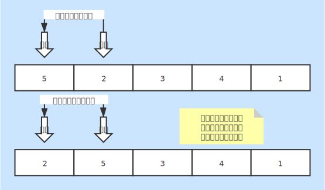

# 插入排序
* 一种基本的内排序

### 基本说明
* 每次将一个数据和自己之前的元素比较，确定当前的相对位置
* 从数据索引1开始，将当前索引位置的数据同之前的数据进行比较移动满足条件的数据，将当前数据插入

### 时间复杂度
* 最好情况：O(n)
    + 数据有序情况下只需要一次遍历
* 最坏情况：O(n2)
    + 每个元素都需要同其他进行比较，然后确定关系
* 平均情况：O(n2)

### 空间复杂度
* 复杂度：O(1)
* 内部完成排序，无需其他空间

### 稳定性
* 稳定排序
* 相同数据同其他元素比较后保证相对位置不变

### 图片说明
