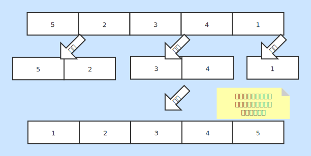

# 归并排序
* 一种基本的内排序

### 基本说明
* 将原数组不断拆分成很小的一部分
* 然后让这小部分内部比较填充到临时数组
* 将临时数组里面有序的数据取回原数组

### 时间复杂度
* 最好情况：O(nlog2n)
* 最坏情况：O(nlog2n)
* 平均情况：O(nlog2n)

### 空间复杂度
* 复杂度：O(n)
* 内部会生成一个临时数组临时保存排序后的数据

### 稳定性
* 稳定排序
* 拆分后进行逐个填充临时区域，元素相对位置不变

### 图片说明
