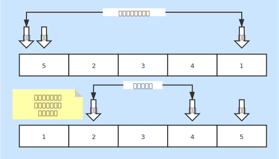

# 快速排序
* 一种基本的内排序

### 基本说明
* 一趟遍历后比基准大的出现在了右边位置，比基准小的值出现在了左边位置
* 定义一个基准，然后让左右指针数据分别与基准比较
* 先让右指针数据与基准比较，满足条件后移动到左指针位置，左指针增加
* 然后左指针再与基准进行比较，满足条件后移动到右指针位置，右指针减少

### 时间复杂度
* 最好情况：O(nlog2n)
    + 基准刚好平分数据
* 最坏情况：O(n2)
    + 数据基本有序，基准每次都是数据中最小或最大
* 平均情况：O(nlog2n)

### 空间复杂度
* 复杂度：O(log2n)
* 需要用到递归，会产生额外空间

### 稳定性
* 不稳定排序
* 按照基准将数据分组，然后再到各个分组内完成排序

### 图片说明
