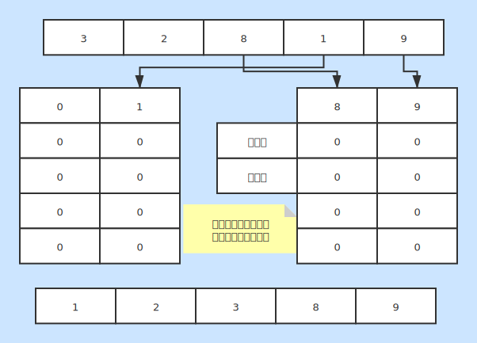

# 基数排序
* 一种基本的内排序

### 基本说明
* 将原数组根据不同位数上的数据放到桶中
* 然后将桶中数据还原到数组中
* 实现了数据基本有序

### 时间复杂度
* 最好情况：O(n)
* 最坏情况：O(n)
* 平均情况：O(n)

### 空间复杂度
* 复杂度：O(n)
* 会使用额外的空间去生成每个数据桶
* 使用额外空间去记录桶中数据

### 稳定性
* 稳定排序
* 分桶操作与对应基数有关，对数据相对位置不产生改变

### 图片说明
