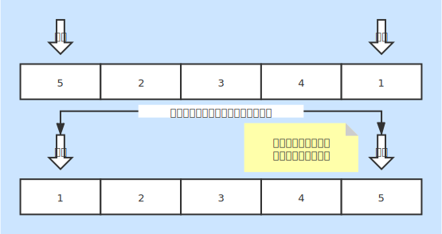

# 选择排序
* 一种基本的内排序

### 基本说明
* 一趟遍历后 **最大（小）**出现在了 **最左（右）**位置
* 从数据中选择一个最大（小）的索引，不断比较更新索引的数据，最后再交换数据

### 时间复杂度
* 最好情况：O(n2)
* 最坏情况：O(n2)
    + 每个元素都需要同其他进行比较，然后确定关系
* 平均情况：O(n2)

### 空间复杂度
* 复杂度：O(1)
* 内部完成排序，无需其他空间

### 稳定性
* 不稳定排序
* 相同数据同其他元素比较后不能保证相对位置不变

### 图片说明
