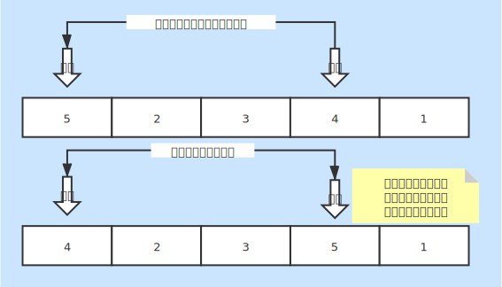

# 希尔排序
* 一种基本的内排序

### 基本说明
* 增量缩小的插入排序
* 从增量开始缩小到 1 数据有序
* 从增量开始比较，满足条件的数据后移，在移动位置插入目标数据

### 时间复杂度
* 最好情况：O(n)
    + 数据有序情况下只需要一次遍历
* 最坏情况：O(nlog2n)
    + 每个元素都需要同其他进行比较，然后确定关系
* 平均情况：O(nlog2n)

### 空间复杂度
* 复杂度：O(1)
* 内部完成排序，无需其他空间

### 稳定性
* 不稳定排序
* 相同数据同其他元素比较后不能保证相对位置不变

### 图片说明
