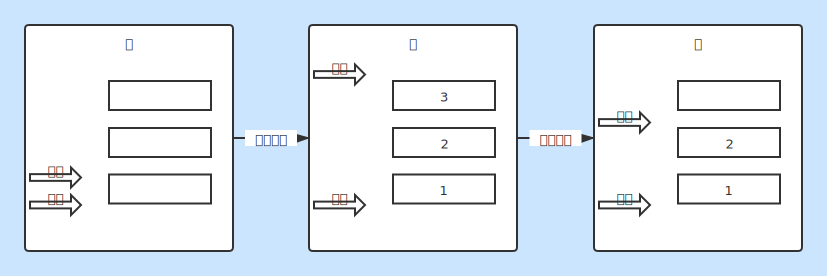

# 栈

### 栈特性
* 先进后出（FILO）
* 始终从栈顶入栈、出栈
* 栈满：栈顶指针等于栈空间
* 栈空：栈顶指针等于栈底指针

### 栈结构
* 栈顶指针：top
* 底层支持数据结构：stack

### 栈的用途
* 元素快速逆转

### 栈生成过程
* 增加元素：栈顶指针增加
* 弹出元素：栈顶指针减少

### 栈实现
* [Stack.java](./Stack.java)

### 图片说明
