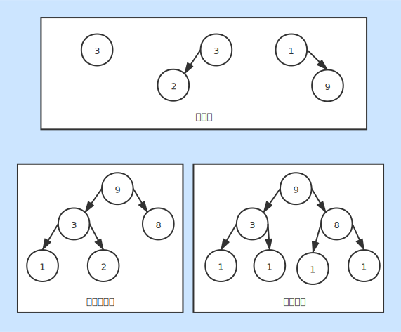

# 二叉树

### 基本概念
* 每个节点最多只能有两个子节点
* 二叉树子节点分为左节点和右节点
* 满二叉树：所有叶子节点都在最后一层，并且节点数为2n-1，n为层数
* 完全二叉树：最后一层的叶子节点左连续，倒数第二层的叶子节点右连续

### 二叉树遍历
1. 先序遍历
    + 根节点 左子节点 右子节点
    + 将根节点输出
    + 入栈右子节点
    + 入栈左子节点
    + 最后一一出栈
2. 中序遍历
    + 左子节点 根节点 右子节点
    + 入栈左子节点
    + 输出出栈节点
    + 查看栈顶节点是否含有非空右子节点
    + 入栈非空右子节点
    + 最后一一出栈
3. 后序遍历
    + 左子节点 右子节点 根节点
    + 入栈左子节点
    + 记录上次访问节点
    + 查看栈顶节点是否含有非空右子节点
    + 入栈非空右子节点
    + 输出出栈节点
    + 最后一一出栈
4. 层次序遍历
    + 按层次进行遍历
    + 使用列表作为队列
    + 入队头节点
    + 出队头节点
    + 出队节点左子节点入队
    + 出队节点右子节点入队
    + 直到队列为空

### 遍历实现方式
1. [递归实现](./BinaryTreeRecursion.java)
2. [非递归实现](./BinaryTree.java)

### 图示二叉树
