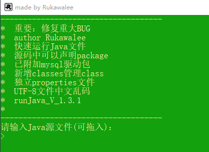

# Java运行工具

### 作用意义
* 在非集成环境下写代码加深代码印象
* 从繁杂的手动编译运行中解脱出来专心代码

### 使用环境
* Java程序
	1. [配置Java环境变量](https://github.com/Rukawalee/ConfigurationTools/tree/master/java)
* Jdbc程序
	1. [配置MySQL环境变量](https://github.com/Rukawalee/ConfigurationTools/tree/master/mysql)
	2. 下载整个[jdbc](../jdbc)尝试

### 使用方法
1. 直接拖入Java源程序文件
2. 复制含Java源程序文件完整路径粘贴
3. 运行结束后直接关闭即可

### 使用须知
* 新文件夹下，请使用文件原定默认文件名
    1. 如果有MySQL驱动请添加lib目录存放驱动
	2. 如果有配置文件请添加properties目录存放文件

### 版本更迭

#### 2019.11.21
* [v1.3.3](./runJava/v1.3.3)
    * 新增附加多个XML配置文件

#### 2019.10.14
* [v1.3.2](./runJava/v1.3.2)
    * 增强附加多个jar包
    * 增加附加多个properties文件
    * 修改界面显示，更加直观清晰

#### 2019.10.12
* [v1.3.1](./runJava/v1.3.1)
    * 独立properties配置文件

#### 2019.10.11
* [v1.3.0](./runJava/v1.3.0)
    * 修复重大BUG：编译不能运行
    * 新增classes管理类

#### 2019.10.10
* [v1.2.0](./runJava/v1.2.0)
    * 修复一些BUG

#### 2019.10.08
* [v1.1.0](./runJava/v1.1.0)
    * 源码可以声明package

#### 2019.03.26
* [v1.0.0](./runJava/v1.0.0)
    * 快速编译运行Java源程序

### 使用效果

